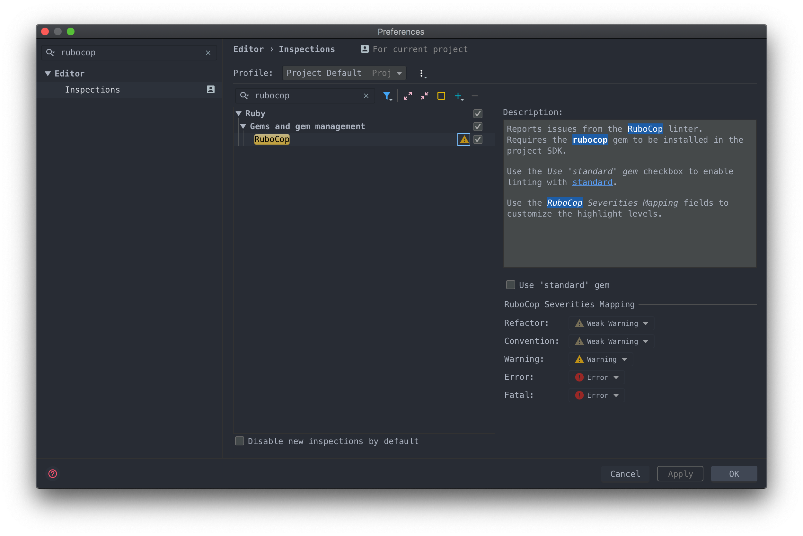
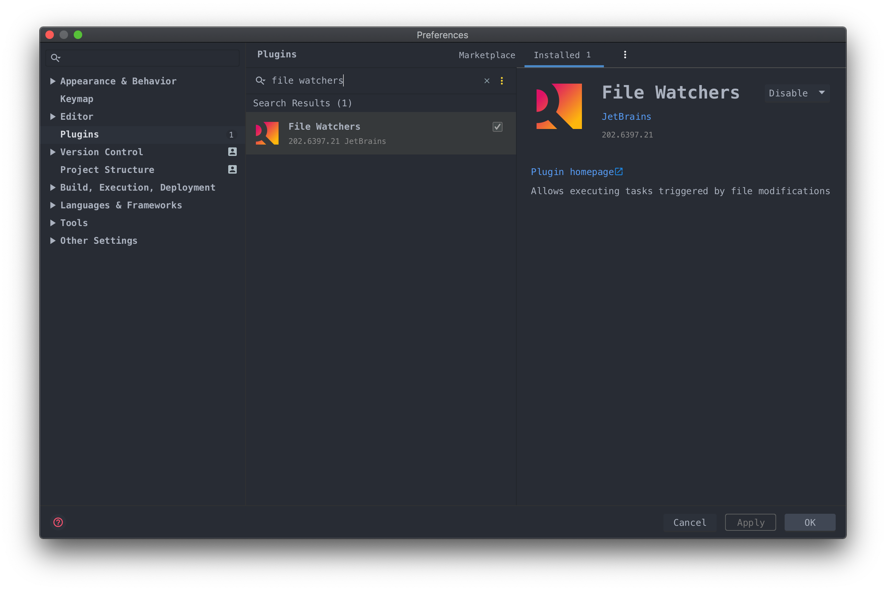
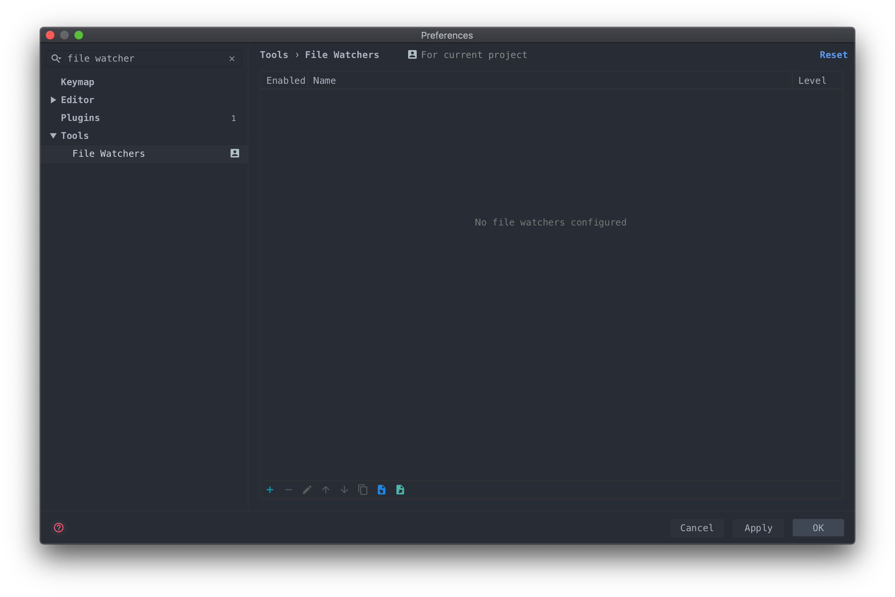
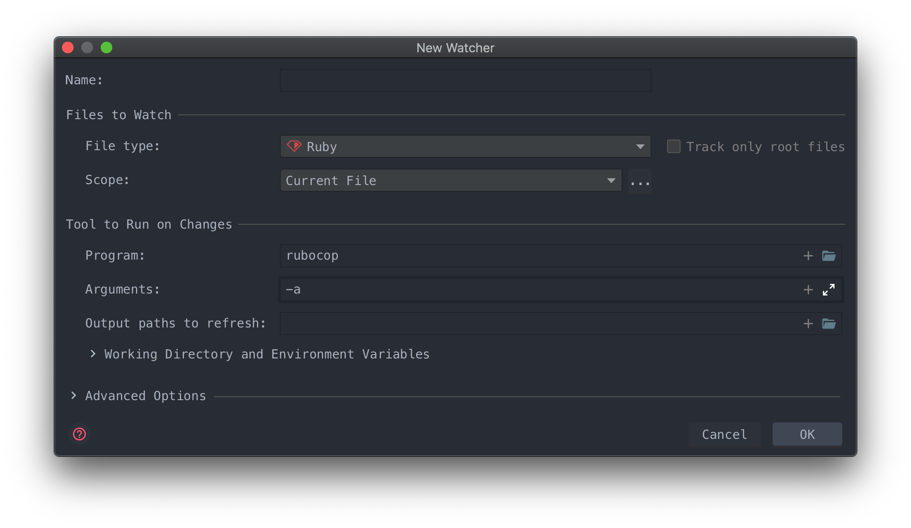

# Run Rubocop on save in RubyMine

> Disclaimer: this guide is not perfect. It is not fast and rubocop will be often run even without saving the current file. Feel free to improve this guide!

## Rubocop linter installation

First, you need Rubocop itself installed on your machine for your project. Simply follow the official [instructions](https://github.com/rubocop-hq/rubocop/blob/master/README.md):

- In your terminal, run:

```bash
gem 'rubocop', require: false
```

- Or install it with Bundler by putting this line in your Gemfile:

```rb
# Choose the appropriate version number
gem 'rubocop', '~> 0.89.0', require: false
```
and run:
```bash
bundle install
```

## Enable Rubocop inspection

Just in case, make sure that Rubocop inspection is enabled for the current project.



## File Watchers plugin setup

- To make it work, I'm using the File Watchers plugin. I have heard about other alternatives like the Save Actions plugin but I couldn't figure out how to set up the `rubocop` command line with it.



- Create a new custom template by clicking the `+` icon.



- What we want is to run the command `rubocop -a` on save for the current file only.



## Git ignore any tmp folders generated by File Watcher (optional)

If File Watcher runs `rubocop -a` on a file and has fixed it, it will generate a tmp folder inside the same folder. If you don't want to commit it, add this line in your .gitignore file:

```
# Ignore all tmp files in the project
**/tmp/**
```
